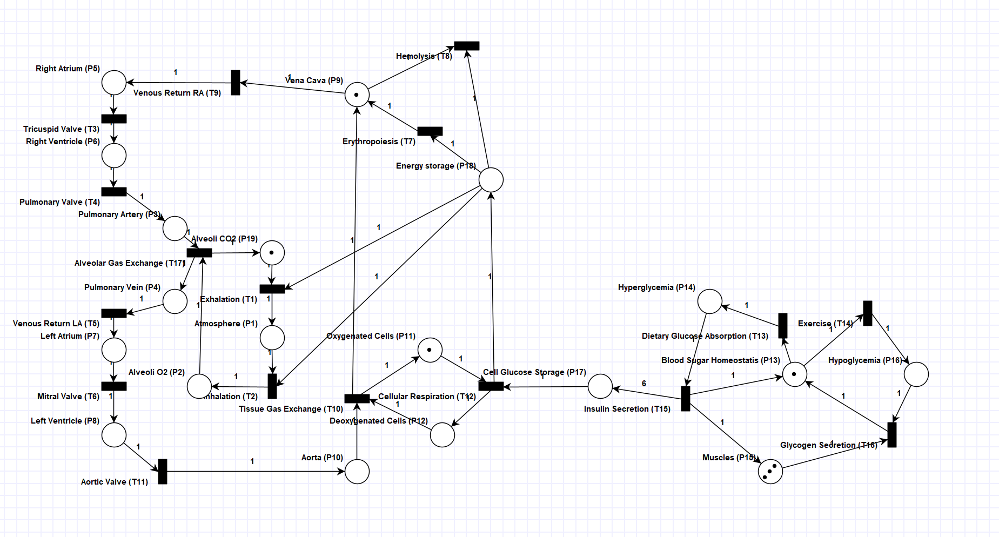
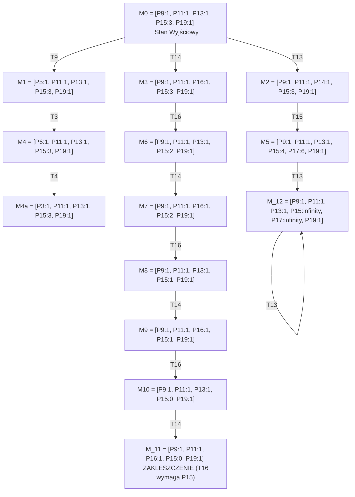

# Analiza Formalna Sieci Petriego: Przepływ Krwi i Cykl Glukozy

Ten model sieci Petriego symuluje sprzężone procesy układu krążenia, wymiany gazowej oraz cyklu glukozowo-insulinowego. Analiza została przeprowadzona na podstawie macierzy strukturalnych oraz grafu osiągalności.

---

## 1. Ogólny opis i rysunek sieci

### Opis Podukładów
Model składa się z **19 miejsc (P1-P19)** oraz **17 przejść (T1-T17)** reprezentujących zintegrowany system:
1. **Układ krążenia:** Przepływ krwi przez jamy serca i naczynia krwionośne (*P3, P4, P5, P6, P7, P8, P9, P10*) sterowany pracą zastawek (*T3, T4, T5, T6, T9, T11*).
2. **Układ oddechowy i wymiana gazowa:** Wentylacja płucna (*T1, T2*) i wymiana pęcherzykowo-tkankowa (*T10, T17*) operujące na poziomach tlenu i dwutlenku węgla (*P1, P2, P11, P12, P19*).
3. **Cykl glukozy i metabolizm:** Zarządzanie poziomem cukru we krwi (*P13, P14, P16*), magazynowanie energii tkankowej (*P17, P18*) oraz praca mięśni (*P15*) regulowane przez hormony (*T15 - Insulina, T16 - Glukagon*).

### Rysunek Sieci

### Własności Strukturalne określane na podstawie Grafu:

* **Automat stanów:** Sieć **nie jest** automatem stanów, ponieważ istnieją przejścia posiadające więcej niż jeden łuk wejściowy lub wyjściowy (np. *T12* pobiera tokeny z *P11* i *P17*, a *T15* zasila jednocześnie *P13, P15, P17*).
* **Graf znakowań:** Sieć **nie jest** grafem znakowań, ponieważ miejsca posiadają wiele łuków wejściowych/wyjściowych (np. *P13* jest współdzielone przez *T13* i *T14*, co strukturalnie reprezentuje mechanizm wyboru/konfliktu).
* **Sieć z wolnym wyborem / rozszerzonym wolnym wyborem:** Sieć **nie należy** do tej klasy. Miejsce *P18* wchodzi do *T1, T2, T7, T8*, ale przejścia te mają różne, niezależne pozostałe zbiory miejsc wejściowych, co uniemożliwia wolny wybór.
* **Sieć prosta / rozszerzona prosta:** Nie spełnia tych kryteriów z powodu asymetrycznych i krzyżujących się powiązań między systemem dystrybucji cukru a zapotrzebowaniem komórkowym.

---

## 2. Macierze wejścia, wyjścia i incydencji

Kolumny reprezentują przejścia (**T1-T17**), wiersze reprezentują miejsca (**P1-P19**).

### Macierz Wyjść

Definiuje liczność tokenów tworzonych w miejscach po odpaleniu przejść.

| Miejsce / Przejście | T1 | T2 | T3 | T4 | T5 | T6 | T7 | T8 | T9 | T10 | T11 | T12 | T13 | T14 | T15 | T16 | T17 |
| --- | --- | --- | --- | --- | --- | --- | --- | --- | --- | --- | --- | --- | --- | --- | --- | --- | --- |
| **P1 (Atmosphere)** | 1 | 0 | 0 | 0 | 0 | 0 | 0 | 0 | 0 | 0 | 0 | 0 | 0 | 0 | 0 | 0 | 0 |
| **P2 (Alveoli O2)** | 0 | 1 | 0 | 0 | 0 | 0 | 0 | 0 | 0 | 0 | 0 | 0 | 0 | 0 | 0 | 0 | 0 |
| **P3 (Pulm. Artery)** | 0 | 0 | 0 | 1 | 0 | 0 | 0 | 0 | 0 | 0 | 0 | 0 | 0 | 0 | 0 | 0 | 0 |
| **P4 (Pulm. Vein)** | 0 | 0 | 0 | 0 | 0 | 0 | 0 | 0 | 0 | 0 | 0 | 0 | 0 | 0 | 0 | 0 | 1 |
| **P5 (Right Atrium)** | 0 | 0 | 0 | 0 | 0 | 0 | 0 | 0 | 1 | 0 | 0 | 0 | 0 | 0 | 0 | 0 | 0 |
| **P6 (Right Ventricle)** | 0 | 0 | 1 | 0 | 0 | 0 | 0 | 0 | 0 | 0 | 0 | 0 | 0 | 0 | 0 | 0 | 0 |
| **P7 (Left Atrium)** | 0 | 0 | 0 | 0 | 1 | 0 | 0 | 0 | 0 | 0 | 0 | 0 | 0 | 0 | 0 | 0 | 0 |
| **P8 (Left Ventricle)** | 0 | 0 | 0 | 0 | 0 | 1 | 0 | 0 | 0 | 0 | 0 | 0 | 0 | 0 | 0 | 0 | 0 |
| **P9 (Vena Cava)** | 0 | 0 | 0 | 0 | 0 | 0 | 1 | 0 | 0 | 1 | 0 | 0 | 0 | 0 | 0 | 0 | 0 |
| **P10 (Aorta)** | 0 | 0 | 0 | 0 | 0 | 0 | 0 | 0 | 0 | 0 | 1 | 0 | 0 | 0 | 0 | 0 | 0 |
| **P11 (Oxygen. Cells)** | 0 | 0 | 0 | 0 | 0 | 0 | 0 | 0 | 0 | 1 | 0 | 0 | 0 | 0 | 0 | 0 | 0 |
| **P12 (Deoxygen. Cells)** | 0 | 0 | 0 | 0 | 0 | 0 | 0 | 0 | 0 | 0 | 0 | 1 | 0 | 0 | 0 | 0 | 0 |
| **P13 (Blood Sugar)** | 0 | 0 | 0 | 0 | 0 | 0 | 0 | 0 | 0 | 0 | 0 | 0 | 0 | 0 | 1 | 1 | 0 |
| **P14 (Hyperglycemia)** | 0 | 0 | 0 | 0 | 0 | 0 | 0 | 0 | 0 | 0 | 0 | 0 | 1 | 0 | 0 | 0 | 0 |
| **P15 (Muscles)** | 0 | 0 | 0 | 0 | 0 | 0 | 0 | 0 | 0 | 0 | 0 | 0 | 0 | 0 | 1 | 0 | 0 |
| **P16 (Hypoglycemia)** | 0 | 0 | 0 | 0 | 0 | 0 | 0 | 0 | 0 | 0 | 0 | 0 | 0 | 1 | 0 | 0 | 0 |
| **P17 (Cell Glu. Stor.)** | 0 | 0 | 0 | 0 | 0 | 0 | 0 | 0 | 0 | 0 | 0 | 0 | 0 | 0 | 6 | 0 | 0 |
| **P18 (Energy Storage)** | 0 | 0 | 0 | 0 | 0 | 0 | 0 | 0 | 0 | 0 | 0 | 1 | 0 | 0 | 0 | 0 | 0 |
| **P19 (Alveoli CO2)** | 0 | 0 | 0 | 0 | 0 | 0 | 0 | 0 | 0 | 0 | 0 | 0 | 0 | 0 | 0 | 0 | 1 |

### Macierz Wejść

Definiuje liczność tokenów pobieranych z miejsc w celu odpalenia przejść.

| Miejsce / Przejście | T1 | T2 | T3 | T4 | T5 | T6 | T7 | T8 | T9 | T10 | T11 | T12 | T13 | T14 | T15 | T16 | T17 |
| --- | --- | --- | --- | --- | --- | --- | --- | --- | --- | --- | --- | --- | --- | --- | --- | --- | --- |
| **P1 (Atmosphere)** | 0 | 1 | 0 | 0 | 0 | 0 | 0 | 0 | 0 | 0 | 0 | 0 | 0 | 0 | 0 | 0 | 0 |
| **P2 (Alveoli O2)** | 0 | 0 | 0 | 0 | 0 | 0 | 0 | 0 | 0 | 0 | 0 | 0 | 0 | 0 | 0 | 0 | 1 |
| **P3 (Pulm. Artery)** | 0 | 0 | 0 | 0 | 0 | 0 | 0 | 0 | 0 | 0 | 0 | 0 | 0 | 0 | 0 | 0 | 1 |
| **P4 (Pulm. Vein)** | 0 | 0 | 0 | 0 | 1 | 0 | 0 | 0 | 0 | 0 | 0 | 0 | 0 | 0 | 0 | 0 | 0 |
| **P5 (Right Atrium)** | 0 | 0 | 1 | 0 | 0 | 0 | 0 | 0 | 0 | 0 | 0 | 0 | 0 | 0 | 0 | 0 | 0 |
| **P6 (Right Ventricle)** | 0 | 0 | 0 | 1 | 0 | 0 | 0 | 0 | 0 | 0 | 0 | 0 | 0 | 0 | 0 | 0 | 0 |
| **P7 (Left Atrium)** | 0 | 0 | 0 | 0 | 0 | 1 | 0 | 0 | 0 | 0 | 0 | 0 | 0 | 0 | 0 | 0 | 0 |
| **P8 (Left Ventricle)** | 0 | 0 | 0 | 0 | 0 | 0 | 0 | 0 | 0 | 0 | 1 | 0 | 0 | 0 | 0 | 0 | 0 |
| **P9 (Vena Cava)** | 0 | 0 | 0 | 0 | 0 | 0 | 0 | 1 | 1 | 0 | 0 | 0 | 0 | 0 | 0 | 0 | 0 |
| **P10 (Aorta)** | 0 | 0 | 0 | 0 | 0 | 0 | 0 | 0 | 0 | 1 | 0 | 0 | 0 | 0 | 0 | 0 | 0 |
| **P11 (Oxygen. Cells)** | 0 | 0 | 0 | 0 | 0 | 0 | 0 | 0 | 0 | 0 | 0 | 1 | 0 | 0 | 0 | 0 | 0 |
| **P12 (Deoxygen. Cells)** | 0 | 0 | 0 | 0 | 0 | 0 | 0 | 0 | 0 | 1 | 0 | 0 | 0 | 0 | 0 | 0 | 0 |
| **P13 (Blood Sugar)** | 0 | 0 | 0 | 0 | 0 | 0 | 0 | 0 | 0 | 0 | 0 | 0 | 1 | 1 | 0 | 0 | 0 |
| **P14 (Hyperglycemia)** | 0 | 0 | 0 | 0 | 0 | 0 | 0 | 0 | 0 | 0 | 0 | 0 | 0 | 0 | 1 | 0 | 0 |
| **P15 (Muscles)** | 0 | 0 | 0 | 0 | 0 | 0 | 0 | 0 | 0 | 0 | 0 | 0 | 0 | 0 | 0 | 1 | 0 |
| **P16 (Hypoglycemia)** | 0 | 0 | 0 | 0 | 0 | 0 | 0 | 0 | 0 | 0 | 0 | 0 | 0 | 0 | 0 | 1 | 0 |
| **P17 (Cell Glu. Stor.)** | 0 | 0 | 0 | 0 | 0 | 0 | 0 | 0 | 0 | 0 | 0 | 1 | 0 | 0 | 0 | 0 | 0 |
| **P18 (Energy Storage)** | 1 | 1 | 0 | 0 | 0 | 0 | 1 | 1 | 0 | 0 | 0 | 0 | 0 | 0 | 0 | 0 | 0 |
| **P19 (Alveoli CO2)** | 1 | 0 | 0 | 0 | 0 | 0 | 0 | 0 | 0 | 0 | 0 | 0 | 0 | 0 | 0 | 0 | 0 |

### Macierz Incydencji

Reprezentuje całkowity bilans zmian w sieci.

| Miejsce / Przejście | T1 | T2 | T3 | T4 | T5 | T6 | T7 | T8 | T9 | T10 | T11 | T12 | T13 | T14 | T15 | T16 | T17 |
| --- | --- | --- | --- | --- | --- | --- | --- | --- | --- | --- | --- | --- | --- | --- | --- | --- | --- |
| **P1 (Atmosphere)** | 1 | -1 | 0 | 0 | 0 | 0 | 0 | 0 | 0 | 0 | 0 | 0 | 0 | 0 | 0 | 0 | 0 |
| **P2 (Alveoli O2)** | 0 | 1 | 0 | 0 | 0 | 0 | 0 | 0 | 0 | 0 | 0 | 0 | 0 | 0 | 0 | 0 | -1 |
| **P3 (Pulm. Artery)** | 0 | 0 | 0 | 1 | 0 | 0 | 0 | 0 | 0 | 0 | 0 | 0 | 0 | 0 | 0 | 0 | -1 |
| **P4 (Pulm. Vein)** | 0 | 0 | 0 | 0 | -1 | 0 | 0 | 0 | 0 | 0 | 0 | 0 | 0 | 0 | 0 | 0 | 1 |
| **P5 (Right Atrium)** | 0 | 0 | -1 | 0 | 0 | 0 | 0 | 0 | 1 | 0 | 0 | 0 | 0 | 0 | 0 | 0 | 0 |
| **P6 (Right Ventricle)** | 0 | 0 | 1 | -1 | 0 | 0 | 0 | 0 | 0 | 0 | 0 | 0 | 0 | 0 | 0 | 0 | 0 |
| **P7 (Left Atrium)** | 0 | 0 | 0 | 0 | 1 | -1 | 0 | 0 | 0 | 0 | 0 | 0 | 0 | 0 | 0 | 0 | 0 |
| **P8 (Left Ventricle)** | 0 | 0 | 0 | 0 | 0 | 1 | 0 | 0 | 0 | 0 | -1 | 0 | 0 | 0 | 0 | 0 | 0 |
| **P9 (Vena Cava)** | 0 | 0 | 0 | 0 | 0 | 0 | 1 | -1 | -1 | 1 | 0 | 0 | 0 | 0 | 0 | 0 | 0 |
| **P10 (Aorta)** | 0 | 0 | 0 | 0 | 0 | 0 | 0 | 0 | 0 | -1 | 1 | 0 | 0 | 0 | 0 | 0 | 0 |
| **P11 (Oxygen. Cells)** | 0 | 0 | 0 | 0 | 0 | 0 | 0 | 0 | 0 | 1 | 0 | -1 | 0 | 0 | 0 | 0 | 0 |
| **P12 (Deoxygen. Cells)** | 0 | 0 | 0 | 0 | 0 | 0 | 0 | 0 | 0 | -1 | 0 | 1 | 0 | 0 | 0 | 0 | 0 |
| **P13 (Blood Sugar)** | 0 | 0 | 0 | 0 | 0 | 0 | 0 | 0 | 0 | 0 | 0 | 0 | -1 | -1 | 1 | 1 | 0 |
| **P14 (Hyperglycemia)** | 0 | 0 | 0 | 0 | 0 | 0 | 0 | 0 | 0 | 0 | 0 | 0 | 1 | 0 | -1 | 0 | 0 |
| **P15 (Muscles)** | 0 | 0 | 0 | 0 | 0 | 0 | 0 | 0 | 0 | 0 | 0 | 0 | 0 | 0 | 1 | -1 | 0 |
| **P16 (Hypoglycemia)** | 0 | 0 | 0 | 0 | 0 | 0 | 0 | 0 | 0 | 0 | 0 | 0 | 0 | 1 | 0 | -1 | 0 |
| **P17 (Cell Glu. Stor.)** | 0 | 0 | 0 | 0 | 0 | 0 | 0 | 0 | 0 | 0 | 0 | -1 | 0 | 0 | 6 | 0 | 0 |
| **P18 (Energy Storage)** | -1 | -1 | 0 | 0 | 0 | 0 | -1 | -1 | 0 | 0 | 0 | 1 | 0 | 0 | 0 | 0 | 0 |
| **P19 (Alveoli CO2)** | -1 | 0 | 0 | 0 | 0 | 0 | 0 | 0 | 0 | 0 | 0 | 0 | 0 | 0 | 0 | 0 | 1 |

### Własności Strukturalne określane na podstawie Macierzy:

* **Brak zachowawczości:** Suma elementów w kolumnie dla *T15* ($1+1+6 = 8$ wyjściowych wobec $1$ wejściowego) wykazuje brak zrównoważenia.

---

## 3. Drzewo pokrycia i graf stanów

Znakowanie początkowe $M_0 = [P19:1, P13:1, P15:3, P11:1, P9:1]$ (pozostałe miejsca posiadają 0 tokenów).

### Graf Osiągalności i Drzewo Pokrycia

Złożoność modelu powoduje generowanie nieograniczoności w gałęzi hiperglikemicznej.

### Własności Behawioralne określane na podstawie Grafu:

* **Sieć k-ograniczona / bezpieczna:** Sieć **nie jest** ograniczona ani bezpieczna. W gałęzi hiperglikemicznej (*M_12) miejsca *P15* oraz *P17* osiągają wartość nieograniczoną.
* **Sieć zachowawcza:** **Nie jest** zachowawcza. Liczba tokenów wzrasta z 7 (w $M_0$) do 13 (w $M_5$), a następnie dąży do nieskończoności.
* **Sieć żywa / z zakleszczeniem:** Sieć **posiada zakleszczenia**. Stan *M_11* jest stanem pochłaniającym (brak aktywnych przejść), ponieważ *T16* wymaga obecności żetonu w *Muscles (P15)*, a zasób ten został zredukowany do zera.
* **Sieć odwracalna:** **Nie jest** odwracalna. Wprowadzenie sieci w stan akumulacji wartości nieograniczonych lub w stan zakleszczenia uniemożliwia ponowne otrzymanie znakowania początkowego $M_0$.

---

## 4. Blokady i pułapki

### Analiza Blokad i Pułapek

Na podstawie struktury wyznaczono minimalne zbiory miejsc:

* **Zbiory tożsame (Blokado-Pułapki):**
* $\{P11, P12\}$ (Pula komórek ustrojowych)
* $\{P1, P2, P19\}$ (Pula gazów oddechowych)
* $\{P13, P14, P16\}$ (Rdzeń gospodarki glukozy)

Ponieważ powyższe zbiory są jednocześnie blokadami i pułapkami oraz zawierają tokeny w $M_0$, **nigdy nie ulegną całkowitemu opróżnieniu**.
* **Blokada Otwarta:**
* $\{P3, P4, P5, P6, P7, P8, P10, P11, P12, P18\}$

Zbiór ten łączy cały układ krążenia z magazynem energii *P18*. Jest blokadą, ale **nie jest pułapką**. Jeśli tokeny opuszczą to środowisko (np. wyczyszczenie rezerw *P18*), zbiór ten na zawsze pozostanie pusty, blokując bezpowrotnie powiązane procesy życiowe.

---

## 5. Podsumowanie

Poniższa tabela stanowi zbiorcze zestawienie wykazanych własności modelowanego systemu.

### Klasyfikacja Własności Modelu

| Typ Własności | Nazwa Własności | Status | Dowód / Źródło Formalne |
| --- | --- | --- | --- |
| **Strukturalne** | Automat stanów | **NIE** | Przejście T12 posiada więcej niż jedno wyjście |
| **Strukturalne** | Graf znakowań | **NIE** | Miejsce P13 posiada wiele łuków wejściowych i wyjściowych. |
| **Strukturalne** | Sieć z wolnym wyborem | **NIE** | Współdzielone miejsce P18 narusza asymetrię wejść przejść. |
| **Strukturalne** | Sieć prosta | **NIE** | Skrzyżowania łuków w regulacji metabolicznej. |
| **Strukturalne** | Blokada minimalna | **TAK** | Wykazano 6 minimalnych blokad (w tym krytyczną otwartą S4). |
| **Strukturalne** | Pułapka minimalna | **TAK** | Wykazano 3 minimalne pułapki (gwarantujące niepustość gazów/komórek). |
| **Behawioralne** | Sieć k-ograniczona | **NIE** | Miejsca P15 i P17 osiągają wartość nieogranioczoną w grafie pokrycia. |
| **Behawioralne** | Sieć bezpieczna | **NIE** | $M_0(P15) = 3$, co narusza warunek 1-ograniczoności. |
| **Behawioralne** | Sieć zachowawcza | **NIE** | Łączny wektor sumy tokenów dynamicznie się zmienia ($M_0=7 \rightarrow M_5=13$). |
| **Behawioralne** | Sieć żywa | **NIE** | Obecność martwych przejść po wejściu w stan hipoglikemicznego głodu. |
| **Behawioralne** | Sieć z zakleszczeniem | **TAK** | Stan *M_12* w grafie osiągalności. |
| **Behawioralne** | Sieć odwracalna | **NIE** | Brak ścieżki powrotnej do $M_0$ z liści zakleszczeń oraz stanów nieograniczonej ilości tokenów. |

### Wnioski Końcowe

Model cechuje się wysoką poprawnością w sekcji **kardiorespiracyjnej** (stabilne pętle i zachowawczych blokado-pułapek). Podukład **metaboliczny** wprowadza jednak niestabilność strukturalną (brak ograniczenia bufora cukru oraz ryzyko krytycznego zakleszczenia z głodu).
